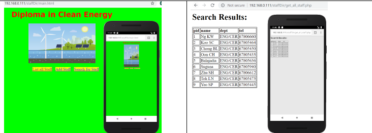

# Clean Energy Web Application

## Overview

This PHP web server application is designed to create a staff directory for the Diploma in Clean Energy program. Users can list all staff, search for staff, add new staff, and update staff details. The application uses PHP and a MySQL database for data storage.

## Requirements
- Create a page that allows users to view a directory of all staff members
- Create a page that allows users to add new staff members to the database
- Create a page that allows users to search for staff members by ID number
- Create a page that allows users to update staff member information

### Main page
 

### List all Staff
 

### Add Staff
 

### Search for Staff
 
 

### Update Staff details
 
 

### MySQL database
 
